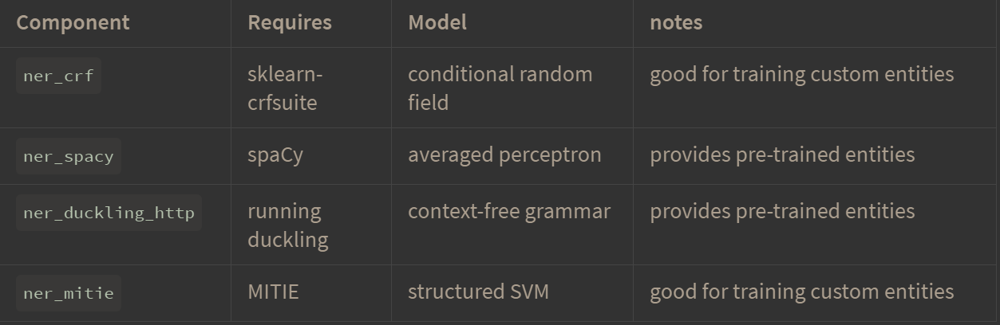
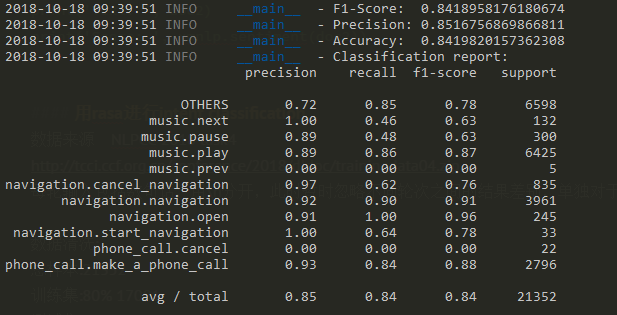
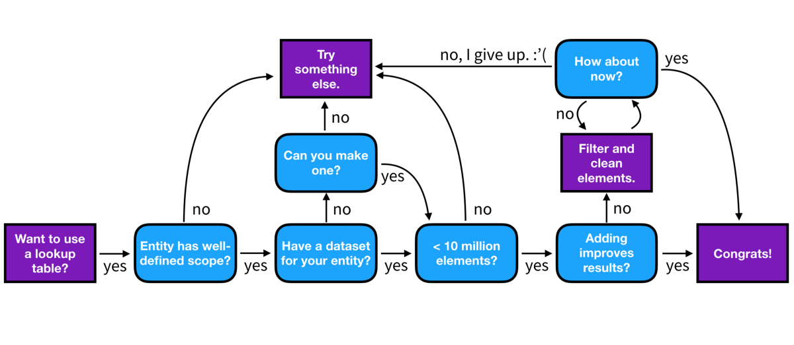

### 使用Rasa构建中文NLU系统
[Rasa](https://rasa.com/)是的AI 对话系统开源框架。可以快速构建自己的对话系统，这里先构建中文的NLU系统，包含分词，情感识别，中文纠错等功能。并且使用[NLPCC 2018 task4](http://tcci.ccf.org.cn/conference/2018/taskdata.php)的数据进行训练，在没有进行专门的调参下仍然取得了不错的效果。NLPCC slot filling的任务留待之后实现。
### 初步运行
ASA 的[基本介绍](https://rasa.com/docs/getting-started/overview/)
这里使用https://github.com/crownpku/Rasa_NLU_Chi 的基本代码，使用了Jieba作为分词工具。
具体的介绍见[这里](http://www.crownpku.com/2017/07/27/%E7%94%A8Rasa_NLU%E6%9E%84%E5%BB%BA%E8%87%AA%E5%B7%B1%E7%9A%84%E4%B8%AD%E6%96%87NLU%E7%B3%BB%E7%BB%9F.html)
##### Rasa中文demo运行：
git clone https://github.com/crownpku/Rasa_NLU_Chi

这里先使用mitie训练词向量。作者已经用维基百科和百度百科的语料预训练了一个词向量。因为mitie模型训练需要巨大的时间(两三天)和内存。所以不建议初学者自己训练。
下载词向量
链接：https://pan.baidu.com/s/1kNENvlHLYWZIddmtWJ7Pdg 密码：p4vx
放到data下。

训练nlu
python -m rasa_nlu.train -c sample_configs/config_jieba_mitie_sklearn.yml --data data/examples/rasa/demo-rasa_zh.json -o models --project current --verbose
这里先都使用demo-rasa_zh.json这个比较小的数据集，用于测试模型效果
打开server
python -m rasa_nlu.server --path ./models

运行:
curl XPOST localhost:5000/parse -d '{"query":"我发烧了该吃什么药", "project": "current"}'

纯命令行使用在之后有各种不便，建议使用python API，具体代码见[这里 ](https://colab.research.google.com/github/RasaHQ/rasa_core/blob/master/getting_started.ipynb#scrollTo=BBF6Nqi9scQE)
##### rasa core
rasa core 是在rasa nlu之后实现对话，需要编写domain,story 等，欲知详情，下回分解。
训练nlu，如果要使用训练好的nlu，要保证nlu和core的版本一致 
python -m rasa_nlu.train -c config_jieba_mitie_sklearn.yml --data data/demo-rasa_zh.json -o models --fixed_model_name mynlu --project current --verbose
训练core
python -m rasa_core.train -d domain.yml -s data/stories.md -o models/current/dialogue --epochs 200
#### rasa ui 
https://github.com/paschmann/rasa-ui

#### pipeline 
Rasa使用pipeline 的方式构建NLU系统，使用者不必完全知道每一步的算法原理，只需要搭积木一样把每一块搭起，具体需要细微调整的可以在之后进行处理。
##### example：
```
language: "zh"

pipeline:
- name: "nlp_mitie"
  model: "data/total_word_feature_extractor_zh.dat"
- name: "tokenizer_jieba"
  default_dict: "./default_dict.big"
  user_dicts: "./jieba_userdict"
# you can put in file path or directory path as the "user_dicts" value
#  user_dicts: "./jieba_userdict/jieba_userdict.txt"
- name: "ner_mitie"
- name: "intent_featurizer_mitie"
- name: "intent_classifier_sklearn"
}
```
pipeline:确定使用语言->加载word2vec->分词->ner->用于intent分类的feature->基于sklearn的Intent 分类
pipeline中的每一个是一个component,用户可以自己定义custom component。
#### cumtom component
介绍在[这里](https://rasa.com/docs/nlu/master/customcomponents/)
class MyComponent(Component):
name 要跟pipeline中使用的一致。
provides 把message传给后面的component 
requires 是这个component 需要的message 
函数:
train 在nlu.train 时会调用，用于根据数据训练对应的模型。如果component 已经训练好，就不需要这一部分
 persist 把训练好的参数保存到某个文件
 load 从文件中读取训练好的参数
 precess 是对message 进行处理，运行自己写的算法。然后传到下一个component 或者在最后输出
 creat 是算法模型的加载部分。如果都写在persist 中每次运行都要加载一次算法。
###优化NLU系统
系统自带有几个NER

ner crf 是根据数据训练得出。其他模块需要预训练。
ner spacy 系统提供了英文的，但并不支持中文。 
#### tensorflow embedding 
可以不使用预训练的词向量，直接用tensorflow构建word embedding。但是只能在数据量大的情况下使用。

#### duckling ner使用
duckling 主要是对数字，时间，距离等名词进行识别。需要自己开一个docker，然后用curl 的方式获取结果。
介绍[此](https://duckling.wit.ai/getting-started)
还有[这里](https://github.com/facebook/duckling#quickstart)

在端口8000上打开docker 
sudo docker run -p 8000:8000 rasa/duckling
测试:
curl -XPOST http://0.0.0.0:8000/parse --data 'locale=en_GB&text=tomorrow at eight'
curl中文：
curl -XPOST http://0.0.0.0:8000/parse --data 'locale=zh_GB&text=明天九点'
在config上添加

```
  name: "ner_duckling_http"
  url: "http://localhost:8000"
  dimensions: ["time", "number", "amount-of-money", "distance"]
```

(可以提供其他的dimension,具体见duckling 的文档)
重新训练。nlu.train ,,,
测试：
curl XPOST localhost:5001/parse -d '{"query":"明天下午五点去吃火锅", "project": "current"}'
curl XPOST localhost:5001/parse -d '{"query":"五十公里", "project": "current"}'


#### 加载别人预训练的spacy 
预训练的中文的spacy，提供了词向量和Ner

https://github.com/howl-anderson/Chinese_models_for_SpaCy/releases
pip install zh_core_web_sm-2.x.x.tar.gz
把该模型设为spacy 中文的默认模型，这样只要在pipeline 中使用language :""zh"就可以使用中文的spacy。
例子
```
language: "zh"

pipeline:
- name: "nlp_spacy"
- name: "tokenizer_jieba"
- name: "ner_spacy"
- name: "intent_entity_featurizer_regex"
- name: "intent_featurizer_spacy"
- name: "intent_classifier_sklearn"
```
spacy link zh_core_web_sm zh

测试:
curl XPOST localhost:5001/parse -d '{"query":"王小明二零一七年在杭州的浙江大学读书", "project": "current"}'
curl XPOST localhost:5001/parse -d '{"query":"我要听周杰伦和蔡依灵在二零一六年的作品", "project": "current"}'
curl XPOST localhost:5001/parse -d '{"query":"今天温度是十八摄氏度", "project": "current"}'
### 调整component优化NLU系统
#### 加载中文纠错模块
- 使用pycorrector
https://github.com/shibing624/pycorrector

```
import pycorrector
corrected_sent, detail = pycorrector.correct('')
print(corrected_sent, detail)
```

模型部分基于Kenlm，目前效果感觉一般，但是已经是开源代码中比较好的了，更新kenlm后可能会好用
将cumtom component代码放在 rasa_nlu/mycomponent目录下。
- 写自己的component 时要先在asa_nlu/registry.py中添加路径
from rasa_nlu.mycomponent.spellchecker import SpellChecker
然后添加component name 
component_classes = [... SpellChecker]
具体的实现代码见
Rasa_NLU_Chi/rasa_nlu/mycomponent/spellchecker.py

#### 加载情感分析模块
情感分析模块使用[xmnlp](https://github.com/SeanLee97/xmnlp)
也可以使用https://github.com/shibing624/text-classifier
具体实现见Rasa_NLU_Chi/rasa_nlu/mycomponent/sentiment_analyzer.py
```
doc = """这件衣服的质量也太差了吧！"""
doc2 = """这酒店真心不错"""
print('Text: ', doc)
print('Score: ', xmnlp.sentiment(doc))
print('Text: ', doc2)
print('Score: ', xmnlp.sentiment(doc2))
```

#### 用rasa进行intent classification 
数据来源　NLPCC 2018 task4
http://tcci.ccf.org.cn/conference/2018/dldoc/trainingdata04.zip
每轮输入包括数句话，用\n分开，此时暂时忽略多轮对话的情况，单独对于每句话进行intent分类。
数据的具体介绍在[这里](http://tcci.ccf.org.cn/conference/2018/dldoc/datadesc-task04.pdf)
数据清洗的代码是NLPCC_intent_classification.ipynb
(把数据保存为json格式有奇怪的bug，必须运行两次才可以。)
总样本:21352
训练集:80% 17081
测试集:20% 

样本数增加后训练时间明显增加,需要并行训练
rasa_nlu.train -t 控制训练的线程数量
1000条数据下的测试结果:

```
 python -m rasa_nlu.evaluate --data /home1/shenxing/Rasa_NLU_Chi/data/rasa_nlpcc_little.json --mode crossvalidation --config sample_configs/config_shen_test.yml
 2018-10-16 21:22:56 INFO     __main__  - CV evaluation (n=10)
2018-10-16 21:22:56 INFO     __main__  - Intent evaluation results
2018-10-16 21:22:56 INFO     __main__  - train Accuracy: 0.954 (0.019)
2018-10-16 21:22:56 INFO     __main__  - train F1-score: 0.954 (0.019)
2018-10-16 21:22:56 INFO     __main__  - train Precision: 0.958 (0.015)
2018-10-16 21:22:56 INFO     __main__  - test Accuracy: 0.800 (0.059)
2018-10-16 21:22:56 INFO     __main__  - test F1-score: 0.800 (0.059)
2018-10-16 21:22:56 INFO     __main__  - test Precision: 0.810 (0.055)
2018-10-16 21:22:56 INFO     __main__  - Entity evaluation results
2018-10-16 21:22:56 INFO     __main__  - Entity extractor: ner_spacy
2018-10-16 21:22:56 INFO     __main__  - train Accuracy: 0.673 (0.003)
2018-10-16 21:22:56 INFO     __main__  - train F1-score: 0.619 (0.004)
2018-10-16 21:22:56 INFO     __main__  - train Precision: 0.573 (0.005)
2018-10-16 21:22:56 INFO     __main__  - Entity extractor: ner_spacy
2018-10-16 21:22:56 INFO     __main__  - test Accuracy: 0.673 (0.027)
2018-10-16 21:22:56 INFO     __main__  - test F1-score: 0.618 (0.035)
2018-10-16 21:22:56 INFO     __main__  - test Precision: 0.573 (0.041)
2018-10-16 21:22:56 INFO     __main__  - Finished evaluation
```
cross validaion 模式时运行时间会需要比较久。

全部数据的训练结果

这个结果是在没有专门进行调整的情况下，直接用rasa自带的分类算法得到的效果。可见效果不错。

#### look up tables
look up table 是通过已有的词表来增强ner crf 的效果，从而提高分类准确率。原理是用强正则匹配词表中的词。
训练数据format为
```
{
    "rasa_nlu_data": {
        "lookup_tables": [
            {
                "name": "plates",
                "elements": "data/test/lookup_tables/plates.txt"
            }
        ]
    }
```

教程
https://medium.com/rasa-blog/entity-extraction-with-the-new-lookup-table-feature-in-rasa-nlu-94c6c30876a3
注意：
- 加入的table 一定不能有错的或者会出现歧义的词
- table 不能太大,会严重影响速度（不能大于１million）
- 可以用常见的词表用来做为对look up table 的清洗，避免对结果影响严重的错误,避免领域之间的交叉
- Keep them narrow，Keep them clean. Keep them short
##### 使用的原则:

这里把NLPCC数据中提供的每个slot dictionary 做为look up table 加入，代码也在NLPCC_intent_classification.ipynb中
问题:
模型用的是ner crf。feature看不懂。可能需要细看ner crf 的源码
```
- name: "ner_crf"
  # The features are a ``[before, word, after]`` array with
  # before, word, after holding keys about which
  # features to use for each word, for example, ``"title"``
  # in array before will have the feature
  # "is the preceding word in title case?".
  # Available features are:
  # ``low``, ``title``, ``suffix5``, ``suffix3``, ``suffix2``,
  # ``suffix1``, ``pos``, ``pos2``, ``prefix5``, ``prefix2``,
  # ``bias``, ``upper`` and ``digit``
  features: [["low", "title"], ["bias", "suffix3"], ["upper", "pos", "pos2"]]
```

#### evaluate
evalutate 时自定义模块容易报错。这部分代码修改中
evaluate 训练过的模型
```
python -m rasa_nlu.evaluate \
    --data data/examples/rasa/demo-rasa.json \
    --model projects/default/model_20180323-145833
```
evaluate crossvalidation的数据，此时不需要训练过的模型

```
python -m rasa_nlu.evaluate \
    --data data/examples/rasa/demo-rasa.json \
    --config sample_configs/config_spacy.yml \
    --mode crossvalidation
```

#### to do 
- rasa core 的具体实现
- 把多个ner 结果的合并以及情感分析的结果用于intent classification。
- 细调nlu模型，提高最后效果
- 测试look up table对于结果的提高
- 添加多轮对话的功能(rasa core)
- 用其他的分类模型。
- 测试运行速度
- 部署UI。
Storing Models in the Cloud
Running in Docker
- 用自己的NLG系统生成对话。
- 能否用gpu加速训练时的keras的计算，(rasa core 的部分)


#### bug
json 中出现中文会报错
medical{"disease": "感冒"}
这种写法在readlines()时会报错
UnicodeDecodeError: 'ascii' codec can't decode byte 0xe9 in position 458: ordinal not in range(128)
要先encode：
a.encode('utf-8')
medical{"disease": "b'\xe6\x84\x9f\xe5\x86\x92'"}

#### some note
- The things your users say are the best source of training data for refining your models. 
Of course your model won’t be perfect, so you will have to manually go through each of these predictions and correct any mistakes before adding them to your training data. 
Learning from real conversations is more important than designing hypothetical ones

